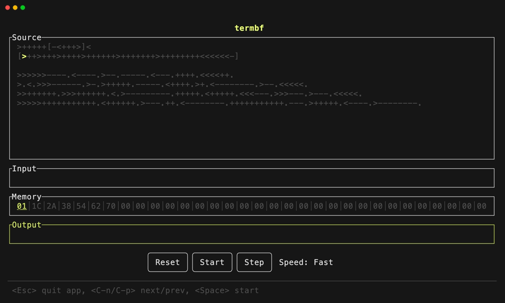

# termbf

[](https://crates.io/crates/termbf)

Terminal Brainf\*ck visualizer



## Installation

```
$ cargo install termbf
```

## Usage

```
termbf - Terminal Brainf*ck visualizer

Usage: termbf --source <FILE>

Options:
  -s, --source <FILE>  brainf*ck source code file
  -h, --help           Print help
  -V, --version        Print version
```

## Brainf\*ck interpreter specification

- EOF returns 0
- cell size is `u8`
- pointer is `u8`
- Exceeding the cell and pointer value range causes a runtime error
- All characters other than the eight basic commands are ignored

## License

MIT
